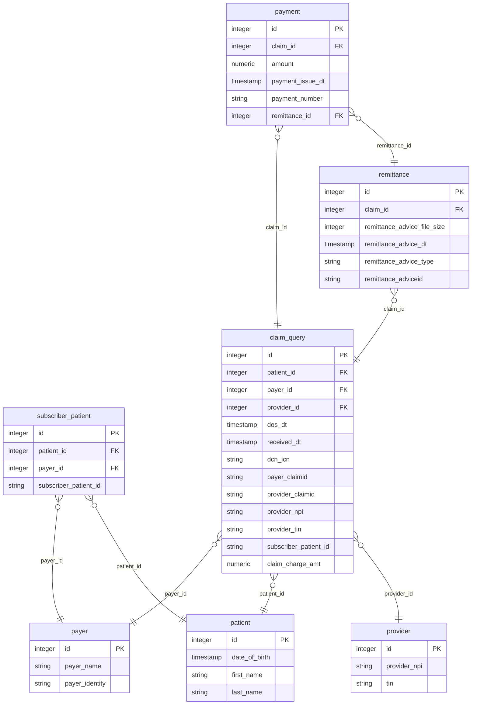

# Postable Remittance

_The Da Vinci Postable Remittance Reference Implementation Microservice that confirms
the [Postable Remittance Implementation Guide (IG)](https://build.fhir.org/ig/HL7/davinci-pr/index.html)_

---

## Table of Contents

- [Postable Remittance](#postable-remittance)
  - [Local Setup](#local-setup)
    - [Requirements](#requirements)
    - [Create environment file](#create-environment-file)
    - [Sample data](#sample-data)
    - [Postman collection](#postman-collection)
  - [Getting Started](#getting-started)
    - [Running with Foundry docker-compose image](#running-with-foundry-docker-compose-image)
    - [Running local build](#running-local-build)
      - [Run the service using docker-compose](#run-the-service-using-docker-compose)
      - [Other handy commands](#other-handy-commands)
      - [To delete and recreate the database (and wipe all data)](#to-delete-and-recreate-the-database-and-wipe-all-data)
      - [Run the service from the command line](#run-the-service-from-the-command-line)
      - [Use IntelliJ IDE to debug and test the microservice](#use-intellij-ide-to-debug-and-test-the-microservice)
    - [Access the service](#access-the-service)
    - [Health and Swagger UI Routes](#health-and-swagger-ui-routes)
  - [Entity Relationship Diagram (ERD)](#entity-relationship-diagram-erd)
  - [Service Endpoints](#service-endpoints)
    - [Endpoints `/$searchByClaim` and `/$searchByPatient`](#endpoints-searchbyclaim-and-searchbypatient)
    - [Endpoint `/$searchByPayment`](#endpoint-searchbypayment)
    - [Endpoint `/$downloadRemittance`](#endpoint-downloadremittance)
    - [Decode and open the remittance document](#decode-and-open-the-remittance-document)
    - [Sample response for no results found or any errors](#sample-response-for-no-results-found-or-any-errors)
  - [Testing from the Swagger-UI](#testing-from-the-swagger-ui)
  - [Scenarios For Testing](#scenarios-for-testing)
    - [Scenario 1: Return a single result](#scenario-1-return-a-single-result)
    - [Scenario 2: Return results with multiple claims/payments/remittances](#scenario-2-return-results-with-multiple-claimspaymentsremittances)
    - [Scenario 3: No match found](#scenario-3-no-match-found)

## Local Setup

### Requirements

- Java version: 17
- Maven version: 3.9.7 (3.6.3+)
- Postgres version: 16
- Docker/Docker Desktop (optional but helpful)

### Create environment file

Create an .env file to store environmental variables used by the service.

- Run `touch .env`
- Copy and paste the data into the file below

```properties
DB_HOST=localhost
DB_PORT=5432
DB_NAME=postgres
DB_USERNAME=postgres
DB_PASSWORD=postgres
DB_ADMIN_USERNAME=postgres
DB_ADMIN_PASSWORD=postgres
LOGICAL_ENV_NAME=local
SERVICE_NAME=postable-remittance
```

### Sample data

- Run service to generate `postable_remittance` schema along with tables in the postgres database
- Add data to the tables using insert queries from [test-data.xlsx](test-data/test-data.xlsx)
- Same queries are included in [initial-data.sql](src/main/resources/db/seeds/initial-data.sql) to populate sample data
  upon service startup
- If required, add new sql files under `src/main/resources/db/seeds/` directory with additional queries

### Postman collection

Postman collection with scenario based examples per endpoints based on sample
data [postman_collection.json](test-data/HL7-Postable-Remit.postman_collection.json)

## Getting Started

### Running with Foundry docker-compose image

- Login to [Foundry](https://foundry.hl7.org) and go to [Account](https://foundry.hl7.org/account)
- Register a "Runtime Platform Environments" with name `postable-remittance`
- Go to [Catalog](https://foundry.hl7.org/) and
  select [Postable Remittance Server](https://foundry.hl7.org/products/db125eeb-eeae-4467-9012-cbce6b13c045)
- Click on "Configuration Wizard" and "Add Configuration to Platform"
- Close the dialog box and go to [My Environments](https://foundry.hl7.org/environments) and select both PostgresSQL
  Server and Postable Remittance Server
- Click on "Docker Stack" and Foundry will generate a docker-compose.yml file that will be downloaded to your local
  machine with name `docker-compose.yml`

- If you want to connect locally running DB client to the database, then add the port mapping to postgresql-server
  section in downloaded docker-compose.yml file as follows:
  - ```yaml
      postgresql-server:
        ports:
          - 5432:5432
    ```

- Go to Downloads directory and run docker-compose.yml with command (`--pull always` will pull the latest image)
  `docker-compose -f docker-compose.yml up -d --pull always`


- If port 5432 is exposed, then you can connect using DB client running locally.
- OR connect to postgresql shell using docker network interface as follows:
  - Since you register a new "Runtime Platform Environment" with name `postable-remittance`, your network interface name
    would be `postable-remittance_network`
  - Run `docker run -it --network postable-remittance_network --rm postgres psql -h postgresql-server -U postgres`
  - Input password mentioned in `docker-compose.yml` file to connect psql shell
  - List out schemas using `\dn` and Select `postgres` database using `\c postgres`
  - List out all tables using `\dt+ postable_remittance.*`
  - Observe any table using describe `\d postable_remittance.claim_query`
  - Fetch some data from table using `SELECT * FROM postable_remittance.claim_query LIMIT 10`
- Once done working with the service, stop both containers using `docker-compose -f docker-compose.yml down`

_Note: A sample Foundry file can be found
here [docker-compose/foundry/docker-compose.yml](docker-compose/foundry/docker-compose.yml)_

### Running local build

#### Run the service using docker-compose
Create docker containers for postgresql and microservice using docker-compose

- Navigate to the `docker-compose` directory
- Run `sh ./up.sh` to create both service and database container
  - Note you may need to run `chmod 777 *.sh` to make the scripts executable.
  - This only needs to be done the first time to create it
  - You may use Docker Desktop to manage it afterward.
  - You should see containers named `davinci-pr-postgres` and `davinci-pr-service` running.
  - If your container for service is running old jar, run `sh ./build-up.sh` file to update image and run.

#### Other handy commands

- `sh ./build-up.sh` will rebuild both service and database docker images and run if you update any file
- `sh ./stop.sh` will stop both service and database containers
- `sh ./down.sh` will delete both service and database containers (wipes data!!!)
- `sh ./db-up.sh` will create and run the database
- `sh ./db-stop.sh` will stop the database

#### To delete and recreate the database (and wipe all data)

- `sh ./down.sh` to delete both service and database containers
- `sh ./up.sh` to create both service and database containers

#### Run the service from the command line

To boot the service locally, use the helper script which loads the environmental variables from your `.env` file.

- Start the service `sh ./run.sh`
  - Note you may need to run `chmod 777 run.sh` to make the scripts executable.
- Stop the service with `^c`

#### Use IntelliJ IDE to debug and test the microservice

- Run microservice in debug mode with breakpoints if required.

### Access the service

- Access the service at: `http://localhost:8080/[endpoint]`

### Health and Swagger UI Routes

- To access the Health: `/actuator/health`
- To access the Actuator: `/actuator`
- To access the Swagger UI: `/swagger-ui/index.html`
- To access the Swagger JSON: `/v3/api-docs`
- To access the Swagger YAML: `/v3/api-docs.yaml`

## Entity Relationship Diagram (ERD)



## Service Endpoints

- The service endpoints are documented as [Artifact Summary](https://build.fhir.org/ig/HL7/davinci-pr/artifacts.html) in
  the IG.
- The input cardinality of individual endpoint is mentioned in respective input parameters links in the following
  table.
- Service will respond with 200 (Ok) for results found, 404 (Not Found) for no results found, 400 (Bad Request) for
any other errors.
- RemittanceAdviceFileSize in Remittance Parameters is in Bytes.

| Service                | Methods | Required Parameters                      | Description                                                                                                                                                                                                                                                                           |
|------------------------|---------|------------------------------------------|---------------------------------------------------------------------------------------------------------------------------------------------------------------------------------------------------------------------------------------------------------------------------------------|
| `/$searchByClaim`      | `POST`  | TIN and ProviderClaimID (PAN)            | This endpoint returns [search results](https://build.fhir.org/ig/HL7/davinci-pr/StructureDefinition-searchResultParameters.html) based on input [claim parameters](https://build.fhir.org/ig/HL7/davinci-pr/StructureDefinition-searchByClaimParameters.html)                         |
| `/$searchByPatient`    | `POST`  | TIN, PatientID, and DateOfBirth          | This endpoint returns [search results](https://build.fhir.org/ig/HL7/davinci-pr/StructureDefinition-searchResultParameters.html) based on input [patient parameters](https://build.fhir.org/ig/HL7/davinci-pr/StructureDefinition-searchByPatientParameters.html)                     |
| `/$searchByPayment`    | `POST`  | TIN, PaymentNumber, and PaymentIssueDate | This endpoint returns [search results](https://build.fhir.org/ig/HL7/davinci-pr/StructureDefinition-searchByPaymentResultParameters.html) based on input [payment parameters](https://build.fhir.org/ig/HL7/davinci-pr/StructureDefinition-searchByPaymentParameters.html)            |
| `/$downloadRemittance` | `POST`  | RemittanceAdviceIdentifier               | This endpoint returns [zipped remittance document](https://build.fhir.org/ig/HL7/davinci-pr/StructureDefinition-remittanceAdviceDocument.html) based on input [remittance parameters](https://build.fhir.org/ig/HL7/davinci-pr/StructureDefinition-downloadRemittanceParameters.html) |

### Endpoints `/$searchByClaim` and `/$searchByPatient`

<details>
<summary>Sample request for /$searchByClaim. Click to expand.</summary>

```shell
curl --location 'http://localhost:8080/$searchByClaim' \
--header 'Content-Type: application/json' \
--data '{
    "resourceType": "Parameters",
    "parameter": [
        {
            "name": "TIN",
            "valueString": "123456789"
        },
        {
            "name": "DateOfService",
            "valuePeriod": {
                "start": "2023-08-01",
                "end": "2023-08-31"
            }
        },
        {
            "name": "PatientID",
            "valueString": "M12345678901"
        },
        {
            "name": "Claim",
            "part": [
                {
                    "name": "ProviderClaimID",
                    "valueString": "12345V12345"
                },
                {
                    "name": "ProviderID",
                    "valueString": "PB654"
                },
                {
                    "name": "ClaimChargeAmount",
                    "valueString": "20.00"
                }
            ]
        },
        {
            "name": "PayerID",
            "valueString": "12345"
        },
        {
            "name": "PayerName",
            "valueString": "ABCDE"
        }
    ]
}'
```

</details>

<details>
<summary>Sample request for /$searchByPatient. Click to expand.</summary>

```shell
curl --location 'http://localhost:8080/$searchByPatient' \
--header 'Content-Type: application/json' \
--data '{
    "resourceType": "Parameters",
    "parameter": [
        {
            "name": "TIN",
            "valueString": "123456789"
        },
        {
            "name": "DateOfService",
            "valuePeriod": {
                "start": "2023-08-01",
                "end": "2023-08-31"
            }
        },
        {
            "name": "Patient",
            "part": [
                {
                    "name": "PatientID",
                    "valueString": "M12345678901"
                },
                {
                    "name": "DateOfBirth",
                    "valueDate": "2000-11-05"
                },
                {
                    "name": "PatientFirstName",
                    "valueString": "QWERT"
                },
                {
                    "name": "PatientLastName",
                    "valueString": "ZXCVB"
                }
            ]
        },
        {
            "name": "PayerID",
            "valueString": "12345"
        },
        {
            "name": "PayerName",
            "valueString": "ABCDE"
        }
    ]
}'
```

</details>

<details>
<summary>Sample response for /$searchByClaim and /$searchByPatient. Click to expand.</summary>

```json
{
  "resourceType": "Parameters",
  "id": "SearchResult",
  "meta": {
    "profile": [
      "http://hl7.org/fhir/us/davinci-pr/StructureDefinition/searchResultParameters"
    ]
  },
  "parameter": [
    {
      "name": "TIN",
      "valueString": "123456789"
    },
    {
      "name": "Payer",
      "part": [
        {
          "name": "PayerID",
          "valueString": "12345"
        },
        {
          "name": "PayerName",
          "valueString": "ABCDE"
        }
      ]
    },
    {
      "name": "Claim",
      "part": [
        {
          "name": "ProviderClaimID",
          "valueString": "12345V12345"
        },
        {
          "name": "ClaimReceivedDate",
          "valueDate": "2023-09-02"
        },
        {
          "name": "ProviderID",
          "valueString": "PB654"
        },
        {
          "name": "PayerClaimID",
          "valueString": "4567891236"
        },
        {
          "name": "PaymentInfo",
          "part": [
            {
              "name": "PaymentDate",
              "valueDate": "2023-10-02"
            },
            {
              "name": "PaymentNumber",
              "valueString": "A123456"
            },
            {
              "name": "PaymentAmount",
              "valueMoney": {
                "value": 20.0,
                "currency": "USD"
              }
            }
          ]
        }
      ]
    },
    {
      "name": "Claim",
      "part": [
        {
          "name": "ProviderClaimID",
          "valueString": "12345V12345"
        },
        {
          "name": "ClaimReceivedDate",
          "valueDate": "2023-10-05"
        },
        {
          "name": "ProviderID",
          "valueString": "PB654"
        },
        {
          "name": "PayerClaimID",
          "valueString": "TYU7894562"
        },
        {
          "name": "PaymentInfo",
          "part": [
            {
              "name": "PaymentDate",
              "valueDate": "2023-11-02"
            },
            {
              "name": "PaymentNumber",
              "valueString": "A123456789"
            },
            {
              "name": "PaymentAmount",
              "valueMoney": {
                "value": 50.0,
                "currency": "USD"
              }
            }
          ]
        }
      ]
    },
    {
      "name": "Patient",
      "part": [
        {
          "name": "DateOfBirth",
          "valueDate": "2000-11-05"
        },
        {
          "name": "PatientID",
          "valueString": "M12345678901"
        },
        {
          "name": "PatientFirstName",
          "valueString": "QWERT"
        },
        {
          "name": "PatientLastName",
          "valueString": "ZXCVB"
        }
      ]
    },
    {
      "name": "Remittance",
      "part": [
        {
          "name": "RemittanceAdviceIdentifier",
          "valueString": "A123456BCD"
        },
        {
          "name": "RemittanceAdviceType",
          "valueCode": "835"
        },
        {
          "name": "RemittanceAdviceDate",
          "valueDate": "2023-10-02"
        },
        {
          "name": "RemittanceAdviceFileSize",
          "valueInteger": 1024
        }
      ]
    },
    {
      "name": "Remittance",
      "part": [
        {
          "name": "RemittanceAdviceIdentifier",
          "valueString": "A123456BCDEF"
        },
        {
          "name": "RemittanceAdviceType",
          "valueCode": "835"
        },
        {
          "name": "RemittanceAdviceDate",
          "valueDate": "2023-11-02"
        },
        {
          "name": "RemittanceAdviceFileSize",
          "valueInteger": 1536
        }
      ]
    }
  ]
}
```

</details>

### Endpoint `/$searchByPayment`

<details>
<summary>Sample request. Click to expand.</summary>

```shell
curl --location 'http://localhost:8080/$searchByPayment' \
--header 'Content-Type: application/json' \
--data '{
    "resourceType": "Parameters",
    "parameter": [
        {
            "name": "TIN",
            "valueString": "123456789"
        },
        {
            "name": "DateOfService",
            "valuePeriod": {
                "start": "2023-08-01",
                "end": "2023-08-31"
            }
        },
        {
            "name": "PaymentInfo",
            "part": [
                {
                    "name": "PaymentIssueDate",
                    "valuePeriod": {
                        "start": "2023-09-01",
                        "end": "2023-10-30"
                    }
                },
                {
                    "name": "PaymentAmount",
                    "part": [
                        {
                            "name": "PaymentAmountLow",
                            "valueMoney": {
                                "value": 10.00,
                                "currency": "USD"
                            }
                        },
                        {
                            "name": "PaymentAmountHigh",
                            "valueMoney": {
                                "value": 150.00,
                                "currency": "USD"
                            }
                        }
                    ]
                },
                {
                    "name": "PaymentNumber",
                    "valueString": "A123456"
                }
            ]
        },
        {
            "name": "PayerID",
            "valueString": "12345"
        },
        {
            "name": "PayerName",
            "valueString": "ABCDE"
        }
    ]
}'
```

</details>

<details>
<summary>Sample response. Click to expand.</summary>

```json
{
  "resourceType": "Parameters",
  "id": "SearchResult",
  "meta": {
    "profile": [
      "http://hl7.org/fhir/us/davinci-pr/StructureDefinition/searchByPaymentResultParameters"
    ]
  },
  "parameter": [
    {
      "name": "TIN",
      "valueString": "123456789"
    },
    {
      "name": "Payer",
      "part": [
        {
          "name": "PayerID",
          "valueString": "12345"
        },
        {
          "name": "PayerName",
          "valueString": "ABCDE"
        }
      ]
    },
    {
      "name": "PaymentInfo",
      "part": [
        {
          "name": "PaymentIssueDate",
          "valueDate": "2023-10-02"
        },
        {
          "name": "PaymentNumber",
          "valueString": "A123456"
        },
        {
          "name": "PaymentAmount",
          "valueMoney": {
            "value": 20.0,
            "currency": "USD"
          }
        }
      ]
    },
    {
      "name": "Remittance",
      "part": [
        {
          "name": "RemittanceAdviceIdentifier",
          "valueString": "A123456BCD"
        },
        {
          "name": "RemittanceAdviceType",
          "valueCode": "835"
        },
        {
          "name": "RemittanceAdviceDate",
          "valueDate": "2023-10-02"
        },
        {
          "name": "RemittanceAdviceFileSize",
          "valueInteger": 1024
        }
      ]
    }
  ]
}
```

</details>

### Endpoint `/$downloadRemittance`

<details>
<summary>Sample request. If RemittanceAdviceType is not provided, it will default to PDF. Click to expand.</summary>

```shell
curl --location 'http://localhost:8080/$downloadRemittance' \
--data '{
    "resourceType": "Parameters",
    "parameter": [
        {
            "name": "RemittanceAdviceIdentifier",
            "valueString": "A123456BCD"
        },
        {
            "name": "RemittanceAdviceType",
            "valueCode": "PDF"
        }
    ]
}'
```

</details>

<details>
<summary>Sample response with default advice type as PDF. Click to expand. Note that we are adding optional `text` element with the type 
of the document inside compressed attachment, in this case its value is `RemittanceAdviceType:PDF`.</summary>

```json
{
  "resourceType": "DocumentReference",
  "id": "remittance-document-486e03ec-4749-461d-b37a-5087f78256a9",
  "meta": {
    "profile": [
      "http://hl7.org/fhir/us/davinci-pr/StructureDefinition/remittanceAdviceDocument"
    ]
  },
  "text": {
    "status": "generated",
    "div": "<div xmlns=\"http://www.w3.org/1999/xhtml\">RemittanceAdviceType:PDF</div>"
  },
  "status": "current",
  "content": [
    {
      "attachment": {
        "contentType": "application/zip",
        "data": "UEsDBBQACAgIAI6FJFkAAAAAAAAAAAAAAAAOAAAARU9CLXNhbXBsZS5wZGaVVXlUE/cWRo4oRMSilfDU6rggy4PMTFbGQigQAkW2Bp5BFiEkQ4hCApOBsmlLBYVSLGVJURAVxPoetvCQTRSEh4g0LZRFpAVFFlkEj0CkgAK+BGs5B955bX//zL3f/e4399z7mzsGbiy2GUyiEgz6B1raCVQAAiQBRwkWFqATKhbiQQAMM6ggWxSMoxjIDubhKAvlSwQokynFMZQXQojMKfDsdhlweOd4Czej9FWtw512YgX4Srbd9P1UwWZK/bWhhrAvJvq7/LUTb/dGtFdva/NNKthIcIl1+Qf3wr9K5FE7LHQSife4mkVT7kae4/WLYeHMCS3N/Wd3j6/bIxg6iHhuqvn+dmOd+ah52qamiA/8HW4ODFMIHrk33stRi3Vc/EoNrow0hC6ydGWj3o8qkZ5Q9kATPtSfY0qEjvSoFewL7Q9Fbt7IumCYjMTOhRGYuhm6c1h6TPy5XVrTJc1tm0tKrn6ufWpCIUB04l8r2utGNDZkpUO5vrkpnVo+P7rEzcJbmZP1loHFxCdR7lZWtfNRFU3ZVh2yE1rPq6qKnj54mpjc5Jv7kE9iZ4T5AdguS3nixGB0eeXYWGFh69P1ps3+FtktzaS0cCG9Y93Vx41fZwjrXwt3ztArMnygQOOsnq2uqQXOOjdfbKQjgumDjwa9u25Ze91/5vuo1vaB3gTQe9iX0Z3n2J333cWazHmT22a/GBZxRw6xPnz4vXpmwS154a9al1vKNwjL9b3DFknZC7aFP2y+r3iYXec3NX5j3rRI7d0D6hoX4nadTh1nRjh73yswff5Jr1NNimvf2MzPJqPA6DyR+8XdncM6Hw/kmSqexXlavewL+8m32Ie3daEa355cGcMPhcvmfapnHPQb4quqNSZrKq6cMC4/c+J93C7sWODckatp5L/XSjq3KaoSWg96ZYxe+eHhmg1xa7UVTxKeuDWMRAy6sxo/kt1vmQo6/U3H/JXFgZsRs8+8gjhXGpr7FJaWbcJPiSlyA6d2esUt+D+zqWm7eb90N5J256bOHI7KH/wqNXNwUi1rkzNJkv/c7XIzz+hJHBHbcSbePuDdwJyYmtq+xGhdW15zkv3eHTp7XR83H9eLhBv63CJNWby6SuJsZVkHJTX9VFH5805W/2lqnf+3WurbnSHPY5/Vsrdod54DilvXXpedm7106mrh3Xc6OvTXHbPU7RpJqvNyXUuPDiju3BKXkqt/bZrln28YaDadwSX68sXOVYUta1aInCzbrxlMrbtWsJ/K9OBrHj2qfbIsVzP4xR3/bw3Vt1vCnmNJtWxX7c7oPcWt7Z/NfGMoTjFOL+Cbf57E+XmPHxcjlY5m2DtGCGSYPuuSYzwKmchf3g/bMGSD3oUF1UiXLjeppKs99lVO2ZluWGgSXm4e/hHyq3xvHjb62KpSferw5bRjk9M9pSXOa7eY5MuaTFwvMIsizjcwGZye9Jhhzzv1C5PYeQZoJyuMqs/0OL9XLuZwQ04O3+v/5PV10ns0/xLBZIs8Ol0WKRv/tG29hb2e91GddI3cfXL/c9yEwsQFyMNS9Dcfj7M7GJM5XuvWY9smbJHpaWCxN0tfqofsBHErb7zx+slRNDnZsirrwL839sS6G1YToYS2j9cojbkqzssp50svhuWpd3Zyf1Ts28bhEkrzZK26djGKsovH59g/PYo1C/Kr0S1l+DGO+NWMGiT3LkT2NxPzX6XYqVu7Pvg6SHJYb320vH9PXLbNiJyR4K/4svRQr4aTwYuhMUclkBma+hp0OntDQUDFgt8WlNJSbTT68mbziApFQTeeEAWdUYGIZyOJ9IaUUTpMBhgI2RfkoFJJOMZHpUouWyLGVQ8YgJUUDsgmA+Q3BgWgqAym8oC2ShYqxqUAdSnmxsOUHkB7E39bAbyiApU06B4egKscFQKDNjwpugQ7oMERKC7i80A7sXLdisRCkCsSW4ulorf+si75L+h6iEJQqZmNJFjwJ4Qpf1mYIwnhif+EMu1/DEOq7GK4smsweFAkkHqr5sXxXU5hrEix5eG8YInwTerKVpsvk90wiSCcj2JGIg80Ev8OoJFoJJhCogD/JEMQZEaGyGRgKQTYY5LwUMDlEOBjZG3v5mQWgWJSkUTsY2wM2ipvEq60Wcr/nxHrgDKJCiEQFaZTqWTEDKIaQpChMegsEfx/gp2rjZ+DnTXLjmPkzgsJDUYBJWK8XHYkhgYSIAAhQL8fgE6jUWhAIPAbBlPMlZ1Yioh/x6gM2iqMRqeuxFToKh6dtooHk2mr38GAVucyaNAyhmM8UTCKqXruLopGAQTkSCQ4wFj6Ij4UB0oA8zcmC/C2oPLJdAFZAJEDAygog8EPpAoQAYSQ+eYCPj0AQZh/zFDdDYOlyZm9nSlBivMwfKmLMEKhEAwM7FzZhP8CUEsHCJt9MTkJBwAA4wgAAFBLAQIUABQACAgIAI6FJFmbfTE5CQcAAOMIAAAOAAAAAAAAAAAAAAAAAAAAAABFT0Itc2FtcGxlLnBkZlBLBQYAAAAAAQABADwAAABFBwAAAAA="
      }
    }
  ]
}
```

</details>

### Decode and open the remittance document

- Decode the base64 content of "data" in attachment object using online decoder tool
  like [base64 Guru](https://base64.guru/converter/decode/file)
- Download the file and unzip to get the remittance document
- PDF type document can be viewed using any PDF viewer
- 835 type document can be decoded using online X12 EDI viewer
  like [Healthcare Data Insight X12 EDI Viewer](https://datainsight.health/edi/viewer)

### Sample response for no results found or any errors

<details>
<summary>Sample response for /$searchByClaim not found results. Click to expand.</summary>

```json
{
  "resourceType": "OperationOutcome",
  "issue": [
    {
      "severity": "error",
      "code": "invalid",
      "diagnostics": "POST Endpoint /$searchByClaim is unable to find any records."
    }
  ]
}
```

</details>

## Testing from the Swagger-UI

- After the service is up and running, access the Swagger UI: `http://localhost:8080/swagger-ui/index.html`
- Expand the operations section and click on "Try it out" button to test the service.
- Modify request body with one of the requests mentioned in the [Scenarios For Testing](#scenarios-for-testing).
- Observe the responses as expected per the scenario.
- <details>
    <summary>Demo of Swagger UI. Click to expand.</summary>
    
  </details>

## Scenarios For Testing

Following scenarios can be used for testing the service. These are based on the [test data](#sample-data) mentioned
above. Same examples will be found in the [postman collection](#postman-collection) along with their respective
responses as well.

### Scenario 1: Return a single result

<details>
<summary>Search by Claim: Ideally single result when requested with TIN and ProviderClaimID (PAN). Click to expand.</summary>

```shell
curl --location 'http://localhost:8080/$searchByClaim' \
--data '{
    "resourceType": "Parameters",
    "parameter": [
        {
            "name": "TIN",
            "valueString": "123456789"
        },
        {
            "name": "DateOfService",
            "valuePeriod": {
                "start": "2023-08-01",
                "end": "2023-08-31"
            }
        },
        {
            "name": "PatientID",
            "valueString": "M12345678901"
        },
        {
            "name": "Claim",
            "part": [
                {
                    "name": "ProviderClaimID",
                    "valueString": "12345V12345"
                },
                {
                    "name": "ProviderID",
                    "valueString": "PB654"
                },
                {
                    "name": "PayerClaimID",
                    "valueString": "4567891236"
                },
                {
                    "name": "ClaimChargeAmount",
                    "valueString": "20.00"
                }
            ]
        },
        {
            "name": "PayerID",
            "valueString": "12345"
        },
        {
            "name": "PayerName",
            "valueString": "ABCDE"
        }
    ]
}'
```

</details>

<details>
<summary>Search by Patient: Ideally single result when requested with TIN, PatientID, and DateOfBirth. Click to expand.</summary>

```shell
curl --location 'http://localhost:8080/$searchByPatient' \
--data '{
    "resourceType": "Parameters",
    "parameter": [
        {
            "name": "TIN",
            "valueString": "123456789"
        },
        {
            "name": "DateOfService",
            "valuePeriod": {
                "start": "2023-08-01",
                "end": "2023-08-31"
            }
        },
        {
            "name": "Patient",
            "part": [
                {
                    "name": "PatientID",
                    "valueString": "M12345678901"
                },
                {
                    "name": "DateOfBirth",
                    "valueDate": "2000-11-05"
                },
                {
                    "name": "PatientFirstName",
                    "valueString": "QWERT"
                },
                {
                    "name": "PatientLastName",
                    "valueString": "ZXCVB"
                }
            ]
        },
        {
            "name": "PayerID",
            "valueString": "12345"
        },
        {
            "name": "PayerName",
            "valueString": "ABCDE"
        }
    ]
}'
```

</details>

<details>
<summary>Search by Payment: Ideally single result when requested with TIN, PaymentNumber, and PaymentIssueDate. Click to expand.</summary>

```shell
curl --location 'http://localhost:8080/$searchByPayment' \
--data '{
    "resourceType": "Parameters",
    "parameter": [
        {
            "name": "TIN",
            "valueString": "123456789"
        },
        {
            "name": "DateOfService",
            "valuePeriod": {
                "start": "2023-08-01",
                "end": "2023-08-31"
            }
        },
        {
            "name": "PaymentInfo",
            "part": [
                {
                    "name": "PaymentIssueDate",
                    "valuePeriod": {
                        "start": "2023-09-01",
                        "end": "2023-11-30"
                    }
                },
                {
                    "name": "PaymentAmount",
                    "part": [
                        {
                            "name": "PaymentAmountLow",
                            "valueMoney": {
                                "value": 10.00,
                                "currency": "USD"
                            }
                        },
                        {
                            "name": "PaymentAmountHigh",
                            "valueMoney": {
                                "value": 150.00,
                                "currency": "USD"
                            }
                        }
                    ]
                },
                {
                    "name": "PaymentNumber",
                    "valueString": "A123456"
                }
            ]
        },
        {
            "name": "PayerID",
            "valueString": "12345"
        },
        {
            "name": "PayerName",
            "valueString": "ABCDE"
        }
    ]
}'
```

</details>

<details>
<summary>Download Remittance: Single result when requested with RemittanceAdviceIdentifier and RemittanceAdviceType as 835. Click to expand.</summary>

```shell
curl --location 'http://localhost:8080/$downloadRemittance' \
--data '{
    "resourceType": "Parameters",
    "parameter": [
        {
            "name": "RemittanceAdviceIdentifier",
            "valueString": "A123456BCDEF"
        },
        {
            "name": "RemittanceAdviceType",
            "valueCode": "835"
        }
    ]
}'
```

</details>

<details>
<summary>Download Remittance: Single result when requested with RemittanceAdviceIdentifier and RemittanceAdviceType as PDF. Click to expand.</summary>

```shell
curl --location 'http://localhost:8080/$downloadRemittance' \
--data '{
    "resourceType": "Parameters",
    "parameter": [
        {
            "name": "RemittanceAdviceIdentifier",
            "valueString": "A123456BCD"
        },
        {
            "name": "RemittanceAdviceType",
            "valueCode": "PDF"
        }
    ]
}'
```

</details>

### Scenario 2: Return results with multiple claims/payments/remittances

<details>
<summary>Search by Claim: Result with multiple claims/payments/remittances when requested with TIN and ProviderClaimID (PAN). Note that the PayerClaimID will not be provided in this case, else it will hard match on that value. Click to expand.</summary>

```shell
curl --location 'http://localhost:8080/$searchByClaim' \
--data '{
    "resourceType": "Parameters",
    "parameter": [
        {
            "name": "TIN",
            "valueString": "123485858"
        },
        {
            "name": "DateOfService",
            "valuePeriod": {
                "start": "2023-08-01",
                "end": "2023-08-31"
            }
        },
        {
            "name": "PatientID",
            "valueString": "M12345513215"
        },
        {
            "name": "Claim",
            "part": [
                {
                    "name": "ProviderClaimID",
                    "valueString": "12345V54321"
                },
                {
                    "name": "ProviderID",
                    "valueString": "PB655"
                },
                {
                    "name": "ClaimChargeAmount",
                    "valueString": "30.00"
                }
            ]
        },
        {
            "name": "PayerID",
            "valueString": "52415"
        },
        {
            "name": "PayerName",
            "valueString": "PayerAB"
        }
    ]
}'
```

</details>

<details>
<summary>Search by Patient: Result with multiple claims/payments/remittances when requested with TIN, PatientID, and DateOfBirth. Click to expand.</summary>

```shell
curl --location 'http://localhost:8080/$searchByPatient' \
--data '{
    "resourceType": "Parameters",
    "parameter": [
        {
            "name": "TIN",
            "valueString": "123485858"
        },
        {
            "name": "DateOfService",
            "valuePeriod": {
                "start": "2023-08-01",
                "end": "2023-08-31"
            }
        },
        {
            "name": "Patient",
            "part": [
                {
                    "name": "PatientID",
                    "valueString": "M12345513215"
                },
                {
                    "name": "DateOfBirth",
                    "valueDate": "2000-11-05"
                },
                {
                    "name": "PatientFirstName",
                    "valueString": "Jane"
                },
                {
                    "name": "PatientLastName",
                    "valueString": "Doe"
                }
            ]
        },
        {
            "name": "PayerID",
            "valueString": "52415"
        },
        {
            "name": "PayerName",
            "valueString": "PayerAB"
        }
    ]
}'
```

</details>

<details>
<summary>Search by Payment: Result with multiple claims/payments/remittances when requested with TIN, PaymentNumber, and PaymentIssueDate. This also covers partial payment number in request parameter. Click to expand.</summary>

```shell
curl --location 'http://localhost:8080/$searchByPayment' \
--data '{
    "resourceType": "Parameters",
    "parameter": [
        {
            "name": "TIN",
            "valueString": "123485858"
        },
        {
            "name": "DateOfService",
            "valuePeriod": {
                "start": "2023-08-01",
                "end": "2023-08-31"
            }
        },
        {
            "name": "PaymentInfo",
            "part": [
                {
                    "name": "PaymentIssueDate",
                    "valuePeriod": {
                        "start": "2023-09-01",
                        "end": "2023-11-30"
                    }
                },
                {
                    "name": "PaymentAmount",
                    "part": [
                        {
                            "name": "PaymentAmountLow",
                            "valueMoney": {
                                "value": 10.00,
                                "currency": "USD"
                            }
                        },
                        {
                            "name": "PaymentAmountHigh",
                            "valueMoney": {
                                "value": 150.00,
                                "currency": "USD"
                            }
                        }
                    ]
                },
                {
                    "name": "PaymentNumber",
                    "valueString": "A123"
                }
            ]
        },
        {
            "name": "PayerID",
            "valueString": "52415"
        },
        {
            "name": "PayerName",
            "valueString": "PayerAB"
        }
    ]
}'
```

</details>

### Scenario 3: No match found

<details>
<summary>Search by Claim: No match found when requested with random TIN. Click to expand.</summary>

```shell
curl --location 'http://localhost:8080/$searchByClaim' \
--data '{
    "resourceType": "Parameters",
    "parameter": [
        {
            "name": "TIN",
            "valueString": "000909090"
        },
        {
            "name": "Claim",
            "part": [
                {
                    "name": "ProviderClaimID",
                    "valueString": "12345V12345"
                }
            ]
        }
    ]
}'
```

</details>

<details>
<summary>Search by Patient: No match found when requested with random TIN. Click to expand.</summary>

```shell
curl --location 'http://localhost:8080/$searchByPatient' \
--data '{
    "resourceType": "Parameters",
    "parameter": [
        {
            "name": "TIN",
            "valueString": "000909090"
        },
        {
            "name": "Patient",
            "part": [
                {
                    "name": "PatientID",
                    "valueString": "M12345678901"
                },
                {
                    "name": "DateOfBirth",
                    "valueDate": "2000-11-05"
                }
            ]
        }
    ]
}'
```

</details>

<details>
<summary>Search by Payment: No match found when requested with random TIN. Click to expand.</summary>

```shell
curl --location 'http://localhost:8080/$searchByPayment' \
--data '{
    "resourceType": "Parameters",
    "parameter": [
        {
            "name": "TIN",
            "valueString": "000909090"
        },
        {
            "name": "PaymentInfo",
            "part": [
                {
                    "name": "PaymentIssueDate",
                    "valuePeriod": {
                        "start": "2023-09-01",
                        "end": "2023-10-30"
                    }
                },
                {
                    "name": "PaymentNumber",
                    "valueString": "A123"
                }
            ]
        }
    ]
}'
```

</details>


<details>
<summary>Download Remittance: No match found when requested with random remittance advice ID. Click to expand.</summary>

```shell
curl --location 'http://localhost:8080/$downloadRemittance' \
--data '{
    "resourceType": "Parameters",
    "parameter": [
        {
            "name": "RemittanceAdviceIdentifier",
            "valueString": "ABCD123546"
        },
        {
            "name": "RemittanceAdviceType",
            "valueCode": "PDF"
        }
    ]
}'
```

</details>
